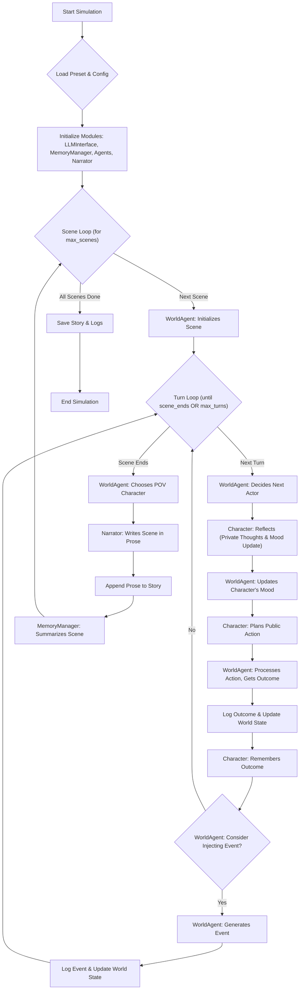

# FicWorld

FicWorld is a multi-agent story generation experiment that creates *autonomous, emergent narratives* through the interactions between character agents with emotion, private reasoning, and memory. Most AI-driven storywriting is done by a single LLM trying to craft a story in a certain tone or style, reasoning through all the elements that make up a story itself. FicWorld takes a different approach - the story is an *emergent* property that comes about through multiple agents acting with their own motivations. Each character is its own agent with its own memory stream, personality, backstory, personal thoughts and emotional state, responding to a world driven by a World Agent and weaved into a story by a Narrator Agent. Think of it as a play with a director, script writer, setting designer, narrator, and a cast of actors. Toss them onto the stage and see what happens! 😛

Alternatively, for control over how the story develops, you can use `script` mode with a list of beats for each scene. I'll explain how that works below.

## How FicWorld Works

FicWorld orchestrates a story by simulating interactions between autonomous Character Agents within an environment managed by a World Agent. A Narrator Agent then crafts these interactions into prose. The simulation progresses in scenes, and each scene is composed of multiple turns.

Here's a high-level flow:



**Key Steps in the Loop:**

1.  **Initialization:** The system loads a preset configuration defining the world, characters, and simulation parameters. Core modules (LLM interface, memory manager, agents, narrator) are initialized.
2.  **Scene Loop:** The simulation proceeds scene by scene.
    *   **Scene Setup:** The `WorldAgent` initializes the environment for the current scene.
    *   **Turn Loop:** Within each scene, multiple turns occur:
        *   **Actor Selection:** The `WorldAgent` decides which `CharacterAgent` acts next (LLM call).
        *   **Character Reflection:** The selected agent performs a private reflection, updating its internal mood (LLM call).
        *   **Character Planning:** The agent then formulates a public action plan (LLM call).
        *   **Action Application:** The `WorldAgent` processes this plan, determines the factual outcome of the action, and updates the overall world state (LLM call to apply plan, LLM call to update state from outcome).
        *   **Memory Update:** The acting character remembers the outcome.
        *   **World Event:** The `WorldAgent` may decide to inject a world event (LLM call to decide, LLM call to generate if yes, LLM call to update state from event outcome).
        *   The scene ends if the `WorldAgent` judges it to be complete (LLM call) or a maximum turn limit is reached.
    *   **Narration:** Once a scene concludes, the `WorldAgent` chooses a point-of-view character (LLM call). The `Narrator` then renders the scene's logged factual outcomes into prose from this character's perspective (LLM call).
    *   **Memory Summarization:** The `MemoryManager` creates a summary of the completed scene (can involve an LLM call).
3.  **Output:** The generated story and detailed simulation logs are saved.

This cycle relies on LLM calls for decision-making, character behavior, and narrative generation, allowing for emergent and dynamic storytelling.


## Installation

1. Clone this repository:
```bash
git clone https://github.com/yourusername/ficworld.git
cd ficworld
```

2. Create and activate a Python virtual environment (Python 3.10+ recommended):
```bash
python -m venv venv312
source venv312/bin/activate  # On Windows: venv312\Scripts\activate
```

3. Install dependencies:
```bash
pip install -r requirements.txt
```

4. Create a `.env` file in the project root and add your API keys. FicWorld primarily uses OpenRouter, so ensure your OpenRouter key is set:
```
OPENROUTER_API_KEY=your_openrouter_api_key
# Add other API keys if other LLM providers are configured in presets
```

## Usage

To run a simulation, use the `main.py` script with the `--preset` argument specifying the name of a preset file located in the `presets/` directory (without the `.json` extension).

**Examples:**

1. Run a simulation with a specific preset (e.g., `demo_forest_run.json`):
   ```bash
   python main.py --preset demo_forest_run
   ```

2. Run in debug mode for more verbose logging:
   ```bash
   python main.py --preset demo_forest_run --debug
   ```

3. Specify a custom output directory:
   ```bash
   python main.py --preset demo_forest_run --output-dir outputs/my_custom_run
   ```

Outputs, including the generated story (`story.md`) and a detailed simulation log (`simulation_log.jsonl`), will be saved in a directory under `outputs/` (e.g., `outputs/demo_forest_run/`) unless a custom output directory is specified.

## Project Structure

- `data/` - Input data (worlds, roles, prompts)
- `presets/` - Configuration files for simulation runs
- `modules/` - Core Python modules
- `outputs/` - Generated stories and logs

## Features

- **Emergent storytelling** through autonomous character agents
- **Emotional memory retrieval** based on character moods
- **Two-layer agent thought process** (private reflection → public action)
- **Separation of simulation and narration**
- **Config-driven approach** for reproducible story generation

## Guiding the Narrative with Beats (Script Mode)

FicWorld can operate in two primary modes: "free" mode and "script" mode. While "free" mode allows the story to emerge entirely from agent interactions, "script" mode enables you to guide the narrative using predefined **script beats**.

**What are Script Beats?**

Script beats are specific plot points, events, character actions, or emotional shifts that you define to shape the story's progression. They provide a skeleton or outline that the `WorldAgent` attempts to follow, while still allowing `CharacterAgents` to react and fill in the details emergently.

**How to Define Beats:**

Script beats are defined within the `worlds/<your_world_name>.json` file, under a `"script_beats"` array. Each beat is an object with properties like:

```json
// Inside your data/worlds/your_world.json
{
  // ... other world properties ...
  "script_beats": [
    {
      "scene_id": 1, // To which scene this beat belongs or should ideally occur in
      "beat_id": "introduction_mystery", // A unique identifier for the beat
      "description": "Characters discover a cryptic map near the old ruins.",
      "required_location": "old_ruins", // Optional: Beat might only trigger if characters are here
      "triggers_event": "event_map_discovered", // Optional: Link to a specific event in world_events_pool
      "target_characters": ["Alice", "Bob"], // Optional: Characters primarily involved or affected
      "desired_outcome_hint": "Alice should express curiosity, Bob suspicion.", // Optional: A hint for agent behavior
      "next_beat_suggestion": "investigate_map" // Optional: Hint for sequencing
    },
    {
      "scene_id": 2,
      "beat_id": "first_obstacle",
      "description": "A sudden rockslide blocks the main path forward.",
      "triggers_event": "event_rockslide"
    }
    // ... more beats
  ]
  // ... other world properties ...
}
```

**Key Beat Properties:**

*   `scene_id`: (Integer) Suggests which scene this beat is intended for.
*   `beat_id`: (String) A unique name for the beat.
*   `description`: (String) A human-readable description of what should happen.
*   `required_location`: (String, Optional) The ID of a location where this beat should ideally occur.
*   `triggers_event`: (String, Optional) The ID of a pre-defined event (from `world_events_pool` in the same world file) that this beat should cause.
*   `target_characters`: (Array of Strings, Optional) Specifies which characters are central to this beat.
*   `desired_outcome_hint`: (String, Optional) A textual hint that can guide the LLM (especially the `WorldAgent` or `CharacterAgents`) towards a certain type of reaction or outcome related to this beat.
*   `next_beat_suggestion`: (String, Optional) Can help the `WorldAgent` in sequencing if multiple beats are eligible.

**How to Use Script Mode:**

1.  **Define Beats in World File:** Add your `script_beats` array to the relevant `data/worlds/<your_world_name>.json` file.
2.  **Configure Preset:** In your `presets/<your_preset_name>.json` file, set the `"mode"` to `"script"`:

    ```json
    // Inside your presets/your_preset.json
    {
      "world_file": "worlds/your_world_name.json",
      "role_files": ["roles/character1.json", "roles/character2.json"],
      "mode": "script", // This activates beat-following behavior
      "max_scenes": 5,
      "llm": {
        "model_name": "deepseek/deepseek-r1:free",
        // ... other llm settings ...
      }
      // ... other preset settings ...
    }
    ```

**How it Works Internally:**

When FicWorld runs in `"script"` mode:

*   The `ConfigLoader` loads the preset and the associated world file, including the `script_beats`.
*   The `WorldAgent` receives this information. Its internal logic (primarily the LLM-driven methods like `decide_next_actor`, `should_inject_event`, `generate_event`, and `judge_scene_end`) is responsible for:
    *   Being aware of the current scene and active beats.
    *   Trying to steer the narrative towards fulfilling the conditions or descriptions of the relevant beats.
    *   Using beat information (like `triggers_event` or `description`) to influence event generation or to provide context to character agents.

By using script beats, you can create a more structured narrative.

## License

[MIT License](LICENSE)