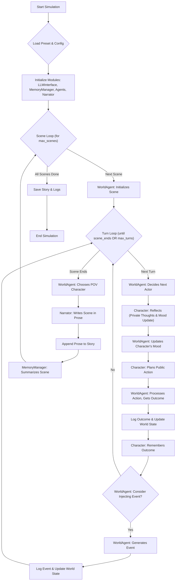

# FicWorld

FicWorld is a multi-agent story generation experiment that creates *autonomous, emergent narratives* through the interactions between character agents with emotion, private reasoning, and memory. Most AI-driven storywriting is done by a single LLM trying to craft a story in a certain tone or style, reasoning through all the elements that make up a story itself. FicWorld takes a different approach - the story is an *emergent* property that comes about through multiple agents acting with their own motivations. Each character is its own agent with its own memory stream, personality, backstory, personal thoughts and emotional state, responding to a world driven by a World Agent and weaved into a story by a Narrator Agent. Think of it as a play with a director, script writer, setting designer, narrator, and a cast of actors. Toss them onto the stage and see what happens! 😛

Alternatively, for control over how the story develops, you can use `script` mode with a list of beats for each scene. I'll explain how that works below.

## How FicWorld Works

FicWorld orchestrates a story by simulating interactions between autonomous Character Agents within an environment managed by a World Agent. A Narrator Agent then crafts these interactions into prose. The simulation progresses in scenes, and each scene is composed of multiple turns.

Here's a high-level flow:



**Key Steps in the Loop:**

1.  **Initialization:** The system loads a preset configuration defining the world, characters, and simulation parameters. Core modules (LLM interface, memory manager, agents, narrator) are initialized.
2.  **Scene Loop:** The simulation proceeds scene by scene.
    *   **Scene Setup:** The `WorldAgent` initializes the environment for the current scene.
    *   **Turn Loop:** Within each scene, multiple turns occur:
        *   **Actor Selection:** The `WorldAgent` decides which `CharacterAgent` acts next (LLM call).
        *   **Character Reflection:** The selected agent performs a private reflection, updating its internal mood (LLM call).
        *   **Character Planning:** The agent then formulates a public action plan (LLM call).
        *   **Action Application:** The `WorldAgent` processes this plan, determines the factual outcome of the action, and updates the overall world state (LLM call to apply plan, LLM call to update state from outcome).
        *   **Memory Update:** The acting character remembers the outcome.
        *   **World Event:** The `WorldAgent` may decide to inject a world event (LLM call to decide, LLM call to generate if yes, LLM call to update state from event outcome).
        *   The scene ends if the `WorldAgent` judges it to be complete (LLM call) or a maximum turn limit is reached.
    *   **Narration:** Once a scene concludes, the `WorldAgent` chooses a point-of-view character (LLM call). The `Narrator` then renders the scene's logged factual outcomes into prose from this character's perspective (LLM call).
    *   **Memory Summarization:** The `MemoryManager` creates a summary of the completed scene (can involve an LLM call).
3.  **Output:** The generated story and detailed simulation logs are saved.

This cycle relies on LLM calls for decision-making, character behavior, and narrative generation, allowing for emergent and dynamic storytelling.


## Installation

1. Clone this repository:
```bash
git clone https://github.com/yourusername/ficworld.git
cd ficworld
```

2. Create and activate a Python virtual environment (Python 3.10+ recommended):
```bash
python -m venv venv312
source venv312/bin/activate  # On Windows: venv312\Scripts\activate
```

3. Install dependencies:
```bash
pip install -r requirements.txt
```

4. Create a `.env` file in the project root and add your API keys. FicWorld primarily uses OpenRouter, so ensure your OpenRouter key is set:
```
OPENROUTER_API_KEY=your_openrouter_api_key
# Add other API keys if other LLM providers are configured in presets
```

## Usage

To run a simulation, use the `main.py` script with the `--preset` argument specifying the name of a preset file located in the `presets/` directory (without the `.json` extension).

**Examples:**

1. Run a simulation with a specific preset (e.g., `demo_forest_run.json`):
   ```bash
   python main.py --preset demo_forest_run
   ```

2. Run in debug mode for more verbose logging:
   ```bash
   python main.py --preset demo_forest_run --debug
   ```

3. Specify a custom output directory:
   ```bash
   python main.py --preset demo_forest_run --output-dir outputs/my_custom_run
   ```

Outputs, including the generated story (`story.md`) and a detailed simulation log (`simulation_log.jsonl`), will be saved in a directory under `outputs/` (e.g., `outputs/demo_forest_run/`) unless a custom output directory is specified.

## Project Structure

- `data/` - Input data (worlds, roles, prompts)
- `presets/` - Configuration files for simulation runs
- `modules/` - Core Python modules
- `outputs/` - Generated stories and logs

## Features

- **Emergent storytelling** through autonomous character agents
- **Emotional memory retrieval** based on character moods
- **Two-layer agent thought process** (private reflection → public action)
- **Separation of simulation and narration**
- **Config-driven approach** for reproducible story generation

## Guiding the Narrative with Plot Structures (Formerly Script Mode)

FicWorld V1 allows for sophisticated narrative control through a **`PlotManager`** that follows a defined **`PlotStructure`**. This replaces the simpler "script mode" and `script_beats` array from earlier versions, offering a more powerful way to define acts, beats, narrative goals, and character involvement. The `Plotmanager` handles the flow from beat to beat. A single "beat" in the `PlotStructure` might span multiple actual scenes; for instance, the "beat_4_new_allies_enemies" might take 2-3 scenes to fully play out (a scene where they meet an ally, another where they have a minor skirmish).

**What is a Plot Structure?**

A Plot Structure is a detailed blueprint for your story, typically defined in a separate JSON or YAML file (e.g., `data/plot_structures/my_epic_adventure.json`). It outlines:

*   **Acts:** Major divisions of your story (e.g., Act I: Setup, Act II: Confrontation, Act III: Resolution).
*   **Beats:** Specific plot points, events, or emotional shifts within each act. Each beat can have:
    *   A unique ID and name.
    *   A description of what should happen.
    *   Narrative goals (e.g., "Introduce the antagonist," "Protagonist faces a setback").
    *   Suggestions for key characters involved.
    *   Setting suggestions.
    *   Hints for event types that might be triggered.

**How to Define a Plot Structure:**

Plot Structures are defined in their own files, typically in `data/plot_structures/`. Here's a conceptual snippet (see `memory-bank/v1/systemPatterns.md` for a detailed example):

```json
// Example: data/plot_structures/my_epic_adventure.json
{
  "plot_name": "The Quest for the Emberstone",
  "description": "A three-act adventure to find a legendary artifact.",
  "acts": [
    {
      "act_id": "act_1_the_call",
      "name": "Act I: The Call to Adventure",
      "beats": [
        {
          "beat_id": "beat_1_ordinary_world",
          "name": "An Ordinary Day",
          "description": "Introduce the protagonist in their normal setting. Establish the status quo.",
          "narrative_goals": ["Establish protagonist's daily life", "Hint at an unfulfilled desire or problem"],
          "key_characters": ["Protagonist"],
          "setting_suggestions": ["Protagonist's village/home"]
        },
        {
          "beat_id": "beat_2_inciting_incident",
          "name": "The Catalyst",
          "description": "An event occurs that disrupts the protagonist's life and presents a challenge or goal.",
          "narrative_goals": ["Disrupt status quo", "Present the main quest/problem"],
          "triggers_event_type": "major_disruption"
        },
        {
          "beat_id": "beat_3_refusal_or_acceptance",
          "name": "The Choice",
          "description": "The protagonist initially hesitates or eagerly accepts the call.",
          "narrative_goals": ["Show protagonist's internal conflict/decision process"]
        }
      ]
    },
    // more acts...
  ]
}
```

**Key Plot Structure Properties (within each beat):**

*   `beat_id` (String): A unique identifier for the beat.
*   `name` (String): A human-readable name for the beat.
*   `description` (String): A detailed description of the intended plot point or event.
*   `narrative_goals` (Array of Strings): What this beat aims to achieve narratively. Along with the beat's description, these are the primary inputs for the PlotManager to guide the WorldAgent and, through context, the CharacterAgents.
*   `key_characters` (Array of Strings, Optional): Suggests characters central to this beat.
*   `setting_suggestions` (Array of Strings, Optional): Hints for where this beat might take place.
*   `triggers_event_type` (String, Optional): Suggests a type of world event that might occur.
*   `max_scenes_per_beat` (Int, Optional): the PlotManager might allow a certain number of scenes to occur while a particular beat is active before forcing a move or re-evaluating.

**How to Use a Plot Structure:**

1.  **Define Your Plot Structure:** Create your `.json` (or `.yaml`) file in `data/plot_structures/`.
2.  **Configure Your Preset:** In your `presets/<your_preset_name>.json` file, specify your plot structure using the `plot_structure_file` key:

    ```json
    // Inside your presets/your_preset.json
    {
      "preset_name": "My Epic Emberstone Adventure",
      "world_file": "data/worlds/generic_fantasy_world.json",
      "role_files": [
        "data/roles/brave_hero.json",
        "data/roles/wise_mentor.json"
      ],
      "plot_structure_file": "data/plot_structures/my_epic_adventure.json", // <-- This activates plot-guided mode
      "max_scenes_per_beat": 5, // Example: control how many scenes can occur within one beat
      "llm": {
        "model_name": "deepseek/deepseek-r1:free"
        // ... other llm settings ...
      }
      // ... other preset settings ...
    }
    ```

**How it Works Internally (V1):**

When a `plot_structure_file` is specified in the preset:

*   The `ConfigLoader` loads the preset, world, roles, AND the specified `PlotStructure`.
*   The `SimulationManager` initializes a `PlotManager` with this loaded structure.
*   The `PlotManager` then guides the entire simulation:
    *   It dictates the progression through Acts and Beats.
    *   It provides context to the `WorldAgent` for scene initialization (suggesting relevant characters, settings based on the current beat).
    *   It influences `WorldAgent` decisions like actor selection and event injection to align with the beat's narrative goals.
    *   It helps determine when a scene (or beat) is complete and when to select POV characters for narration.

This V1 approach provides a more powerful and flexible way to create structured narratives compared to the earlier script beat system.

## License

[MIT License](LICENSE)