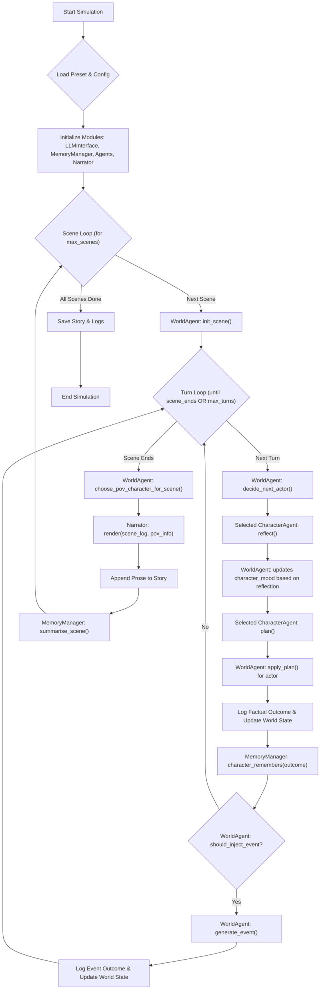

# FicWorld Simulation Loop and Data Flow Analysis (v0)

### May 10, 2025

This document explains the **current** operational flow of a FicWorld simulation, focusing on how scenes and turns progress, where LLM calls are made, and how game state is managed. This is based on the `main.py` script and associated module interactions.

## I. High-Level Simulation Structure

The simulation progresses through a series of **Scenes**. Each scene, in turn, consists of multiple **Turns**.

## II. Key Concepts & State Management

### 1. Scenes vs. Turns
*   **Scene:** A larger narrative unit. A scene begins with `WorldAgent.init_scene()` (which can reset or prepare the world state for a new segment of the story) and continues for a variable number of turns. A scene ends when `WorldAgent.judge_scene_end()` (an LLM call evaluating the scene's log) returns `True`, or when a maximum number of turns for that scene ( `world_agent.max_scene_turns`) is reached.
*   **Turn:** The smallest interactive unit. Within a turn:
    1.  The `WorldAgent` selects an active character.
    2.  The selected character performs a `reflect` (internal monologue, mood update) and then a `plan` (proposing a public action).
    3.  The `WorldAgent` processes this plan (`apply_plan`), determines the factual outcome, and updates the world state.
    4.  The character remembers the outcome.
    5.  The `WorldAgent` may inject a world event.

### 2. World State (`WorldAgent.world_state`)
This is the central repository of the current status of the simulation, managed by the `WorldAgent`. It's a comprehensive object that likely includes:
*   `current_scene_id`: Identifier for the current scene.
*   `turn_number`: Counter for turns within the current scene.
*   `time_of_day`, `environment_description`: Contextual details about the setting.
*   `active_characters`: A list of character names currently participating.
*   `character_states`: A dictionary mapping character names to their individual `CharacterState` objects.
*   `recent_events_summary`: A log or summary of recent factual outcomes.

The `world_state` is dynamically updated by `WorldAgent.update_from_outcome()` after each character action or world event. This method uses an LLM call to parse the textual outcome and modify the structured `world_state` accordingly.

### 3. Character States (`WorldAgent.world_state.character_states`)
This is a dictionary within the main `world_state`, where each key is a character's name, and the value is a `CharacterState` data object. This object holds:
*   `name`, `persona`, `goals`
*   `current_mood` (a `MoodVector` dataclass): This is updated after the character's `reflect()` phase.
*   `activity_coefficient`: Influences likelihood of being chosen.
*   `location`, `conditions` (e.g., "injured"), `inventory`.

## III. Actor Selection & Interaction Model

*   **Actor Selection:** At the start of each turn, `WorldAgent.decide_next_actor()` is called. This method uses an **LLM call** to determine which character should act next. The prompt for this LLM call likely considers the current `world_state`, character activity coefficients, recent events, and narrative flow.
*   **Interaction Model:** Characters act **sequentially**, one at a time per turn.
    1.  The `WorldAgent` selects an actor.
    2.  That specific actor retrieves relevant memories, performs its `reflect()` call (updating its mood within the `WorldAgent`'s `character_states`), and then its `plan()` call.
    3.  The `WorldAgent` processes this single actor's plan via `apply_plan()`, leading to a factual outcome.
    4.  This outcome updates the `world_state` and is recorded.
    Characters are *not* reflecting or planning simultaneously in a way that they are unaware of the immediately preceding action in the same turn. The `current_world_view` provided to an agent for reflection and planning includes the latest state of the world, including recent outcomes.

## IV. Point-of-View (POV) Selection for Narration

*   At the end of each scene (after the turn loop finishes), `WorldAgent.choose_pov_character_for_scene()` is called.
*   This method also uses an **LLM call**. The LLM is likely prompted with a summary of the scene's events and character involvement to choose the most suitable character from whose perspective the scene should be narrated.
*   The chosen `pov_character_name` and their `pov_character_info` (like persona, goals, mood) are then passed to the `Narrator`.

## V. Scene Content and Use of Beats

*   **Scene "Aboutness":** The content or "aboutness" of a scene emerges organically from the sequence of character actions, their interactions, and any world events injected by the `WorldAgent` during the turns of that scene.
*   **Beats and Script Mode:**
    *   The system is designed to support a "script" mode where pre-defined `script_beats` (from the `worlds/<world_name>.json` file) can guide the narrative. These beats define key events, character actions, or emotional shifts.
    *   The `main.py` script loads the `mode` from the preset (e.g., "free" or "script").
    *   The `WorldAgent` receives the full `world_definition`, which includes these `script_beats`.
    *   **Current `main.py` Flow:** The `main.py` loop itself doesn't explicitly iterate through beats. Instead, it relies on the `WorldAgent` to internally use these beats if it's in "script" mode. This means the LLM prompts within `WorldAgent`'s methods (like `generate_event`, `apply_plan`, `judge_scene_end`) would need to be conditioned to consult and follow these beats when `mode == "script"`.
    *   So, while `main.py` sets up the mode, the actual adherence to beats is an internal responsibility of the `WorldAgent`'s LLM-driven logic.

## VI. LLM Call Breakdown Per Scene (Approximate)

Let `C` be the number of characters involved in the scene and `T_avg` be the average number of turns per scene.
Let `T_event_avg` be the average number of turns per scene where a world event is generated (`T_event_avg <= T_avg`).

1.  **Per Turn (Repeated `T_avg` times):**
    *   `WorldAgent.decide_next_actor()`: 1 LLM call
    *   `CharacterAgent.reflect_sync()` (for the selected actor): 1 LLM call
    *   `CharacterAgent.plan_sync()` (for the selected actor): 1 LLM call
    *   `WorldAgent.apply_plan()` (for the selected actor's plan): 1 LLM call
    *   `WorldAgent.update_from_outcome()` (after actor's plan): 1 LLM call
    *   `WorldAgent.should_inject_event()`: 1 LLM call
    *   `WorldAgent.generate_event()` (if should_inject_event is true): 1 LLM call (Occurs `T_event_avg / T_avg` fraction of turns on average)
    *   `WorldAgent.update_from_outcome()` (if event generated): 1 LLM call (Occurs `T_event_avg / T_avg` fraction of turns)
    *   `WorldAgent.judge_scene_end()`: 1 LLM call (This checks at the *start* of the turn loop condition, effectively running `T_avg`+1 times if scene runs full T_avg, or fewer if ends early)

    Simplified per-turn calls (approx): `(1+1+1+1+1+1) = 6` core calls.
    Additional calls if event occurs: `1 (generate) + 1 (update_from_outcome)`.
    Total variable per turn: Roughly `6` to `8` LLM calls.

2.  **Per Scene (Called once):**
    *   `WorldAgent.choose_pov_character_for_scene()`: 1 LLM call
    *   `Narrator.render()`: 1 LLM call
    *   `MemoryManager.summarise_scene()` (via Narrator's LLM call): 1 LLM call

**Total LLM calls per scene (rough estimate):**
`T_avg * (6 + 2 * (T_event_avg / T_avg)) + 3`
`= T_avg * 6 + 2 * T_event_avg + 3`

**Example:** For a scene with 3 characters, averaging 10 turns (`T_avg = 10`), and events occurring in 2 of those turns (`T_event_avg = 2`):
`10 * 6 + 2 * 2 + 3 = 60 + 4 + 3 = 67` LLM calls.

*(Self-correction from thought process: The `judge_scene_end` is part of the while loop condition, so it runs T+1 times for T turns. The `apply_plan` and `update_from_outcome` for character actions occur once per turn for the selected actor. Reflection and Plan also once for selected actor.)*

Revised Per-Turn analysis for `main.py` structure:
*   `WorldAgent.judge_scene_end()`: 1 call (loop condition)
*   `WorldAgent.decide_next_actor()`: 1 call
*   `CharacterAgent.reflect_sync()`: 1 call
*   `CharacterAgent.plan_sync()`: 1 call
*   `WorldAgent.apply_plan()`: 1 call
*   `WorldAgent.update_from_outcome()` (for character): 1 call
*   `WorldAgent.should_inject_event()`: 1 call
*   IF event:
    *   `WorldAgent.generate_event()`: 1 call
    *   `WorldAgent.update_from_outcome()` (for event): 1 call
Total per turn: `7` calls (if no event) or `9` calls (if event).

Total per scene: `T_avg * (7 + 2 * (T_event_avg / T_avg)) + 1 (for the final judge_scene_end call that breaks loop) + 3 (end-of-scene calls)`
`= 7 * T_avg + 2 * T_event_avg + 4`

Example with `T_avg = 10`, `T_event_avg = 2`:
`7 * 10 + 2 * 2 + 4 = 70 + 4 + 4 = 78` LLM calls.

This is a significant number of sequential LLM calls, which explains the potential slowness. Each call has network latency and processing time on the LLM provider's side.

## VII. Summary of Data Flow for One Character Action in a Turn

1.  **WorldAgent (`decide_next_actor` - LLM call):** Selects `Actor_X`.
2.  `Actor_X`'s `CharacterAgent` receives `current_world_view` from `WorldAgent`.
3.  `Actor_X` `memory_manager.retrieve` (local, no LLM).
4.  **`Actor_X` (`reflect_sync` - LLM call):**
    *   Input: `current_world_view`, `relevant_memories`.
    *   Output: `{"updated_mood": {...}, "internal_thought": "..."}`.
5.  `WorldAgent` updates `Actor_X`'s mood in its `character_states`.
6.  **`Actor_X` (`plan_sync` - LLM call):**
    *   Input: `current_world_view`, `relevant_memories`, `internal_thought_summary`.
    *   Output: `{"action": "...", "details": {...}, "tone_of_action": "..."}` (JSON plan).
7.  **`WorldAgent` (`apply_plan` - LLM call):**
    *   Input: `Actor_X` name, `plan_json`.
    *   Output: Textual `factual_outcome` (e.g., "Actor_X moved to the kitchen.").
8.  Log `factual_outcome`.
9.  **`WorldAgent` (`update_from_outcome` - LLM call):**
    *   Input: `factual_outcome` string.
    *   Action: Parses string and updates its internal structured `world_state` (e.g., `character_states[Actor_X].location = "kitchen"`).
10. `Actor_X` `memory_manager.remember` (local, stores `factual_outcome` and current mood).

This sequence (steps 1-10, minus step 1 if not the first actor decision for the turn) repeats for the selected actor. Then, world event injection logic follows, also involving LLM calls.

This detailed flow highlights the numerous LLM interactions, each contributing to the overall processing time per scene. 